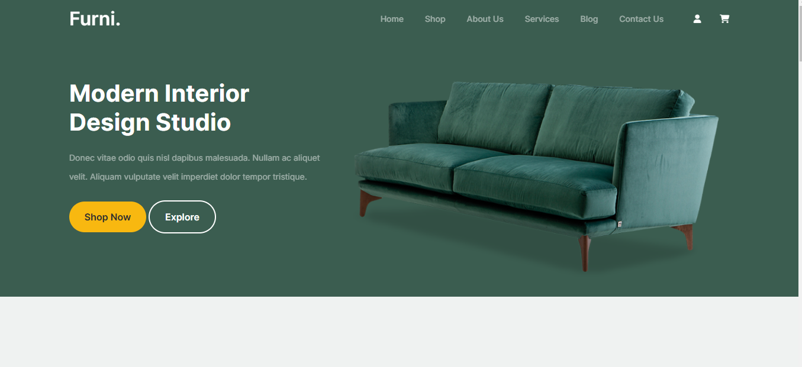

# Furniture Showcasing Website

This project is a static website designed to showcase a variety of furniture items. It was built using HTML and CSS, providing a clean and visually appealing layout for users to browse through different furniture collections and styles.

## Features

- **Homepage** displaying featured furniture pieces and collections.
- **Product Categories** allowing users to explore furniture by type (e.g., living room, bedroom, office).
- **Furniture Details Pages** with high-quality images, descriptions, and specifications of each item.

## Technologies Used

- **HTML** - For structuring the content and pages.
- **CSS** - For styling, layout enhancing the visual appeal of the site.

